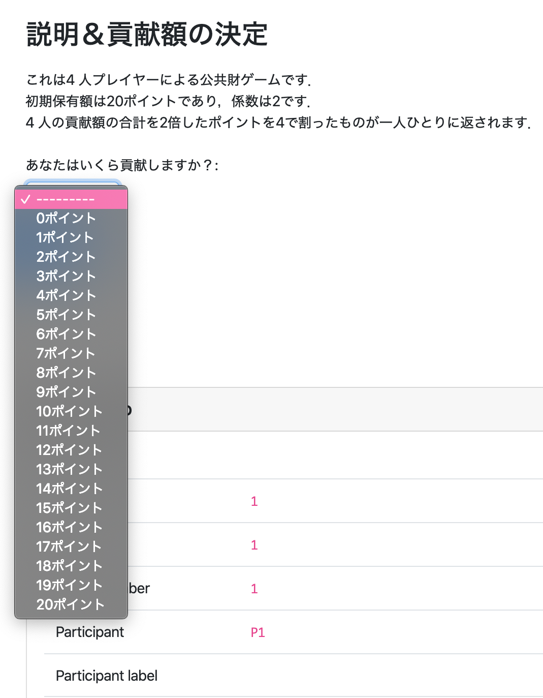
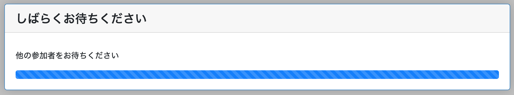
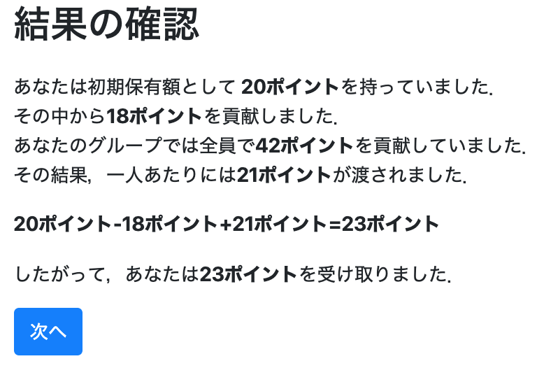

# プログラム①：公共財ゲーム


## これから作る実験プログラムの概要：

* 4人公共財ゲーム
* 初期保有額を20ポイント
* 貢献額の入力には数字を入力する
* 4人の貢献額を合計したものを2倍にする
* それぞれに貢献額の2倍を人数(4人)で割った額が戻る
* ページは3ページ
  - Page1：ルール説明＆貢献額を入力するページ
     <br><br>
  - Page2：全員が貢献額を入力するまで待つページ
     <br><br>
  - Page3：結果を出力するページ
     <br><br>


## アプリを作成する

* その前にフォルダを移動します．
  * Windowsの場合
  ```
  cd C:¥Users¥[PC名]¥Desktop¥otreetest
  ```

  * Macの場合
  ```
  cd Desktop/otreetest
  ```


* 土台となるアプリを作成します．
```
otree startapp public_goods_trial
```


## modelsの定義：
* models.pyでは動作を定義します．

### Constantsクラスの定義：基本設計

* public_goods_trialフォルダ内のmodels.pyを開く
* Constantsクラスの中で人数・繰り返し回数・初期保有額・係数を設定する．

```
class Constants(BaseConstants):
    name_in_url = 'public_goods_trial'
    players_per_group = 4 # 4人プレイヤー
    num_rounds = 1 # 1shotゲーム

    endowment = c(20) # 初期保有額は20ポイント
    multiplier = 2 # 全員の貢献額を2倍にします．
```
  - `names_in_url`，`players_per_group`，`num_rounds`はoTree上で定義されているため，任意の変数名として使うのは望ましくない
  - c()は通貨（金額）として扱うための関数


### Playerクラスの定義：

* Playerクラスの中で，各プレイヤーに関する変数を定義する．
```
class Player(BasePlayer):
    contribution = models.CurrencyField( # 変数"contribution"を定義しよう．
        choices=currency_range(c(0), c(Constants.endowment), c(1)), # 選択肢は最小値0，最大値はConstantsクラスで定義した初期保有額の中で1ずつ変化させることができるようにします．
        label="あなたはいくら貢献しますか？", # 貢献額の選択肢の前にこんな文字列を表示しよう．
    )
```
  - ここではプレイヤーの貢献額を定義している．
  - 貢献額の入力の仕方と上限，下限，入力方法など．
  - 入力方式は自動的に選択方式になります．


### Groupクラスの定義
* Groupクラスの中で全てのプレイヤーの変数に影響を及ぼす関数を定義する．

```
class Group(BaseGroup):
    total_contribution = models.CurrencyField() #全員の合計金額を入れる箱
    individual_share = models.CurrencyField() #全員に分配される金額（合計金額を2倍して人数で割る）を入れる箱

    def compute(self):
        contributions = [p.contribution for p in self.get_players()] # Groupクラスにあるcontributionsとは，プレイヤー全員の貢献額の行列ですよ！
        self.total_contribution = sum(contributions)　# Groupクラスにあるtotal_contributionとは，contributionsの合計です．
        self.individual_share = self.total_contribution * Constants.multiplier / Constants.players_per_group # Groupクラスにあるindividual_shareとは，Groupクラスにあるtotal_contributionとConstantsクラスにあるmultiplierをかけて，Constantsクラスにあるplayers_per_groupで割ったものです．

        for p in self.get_players(): # 各プレイヤーについて，こんな計算をしてください．
            p.payoff = Constants.endowment - p.contribution + self.individual_share # 各プレイヤーのpayoffはConstantsクラスのendowment(保有額)から各プレイヤーのcontributionを引いて，Groupクラスにあるindividual_shareを足します．

```

* `def`以下では関数を定義している．
  - 「こんな感じで計算してよう！よろしく＼(^o^)／」ということを定義している．


## templatesの定義：
* templatesでは具体的な項目を表示するページに決めていきます．

* `public_goods_trial/templates/public_goods_trial`の中に`Page1.html`，，`Page3.html`という2つのhtmlファイルを作成します．
  - `Page1`がルール説明と貢献額入力ページ，`Page3`が結果の表示ページとなる
  - 待ちページは追って説明する．


### 1ページ目

```html

    説明＆貢献額の決定


<p>
    これは{{ Constants.players_per_group }} 人プレイヤーによる公共財ゲームです．<br>
    初期保有額は{{ Constants.endowment }}であり，係数は{{ Constants.multiplier }}です．<br>
    {{ Constants.players_per_group }} 人の貢献額の合計を{{ Constants.multiplier }}倍したポイントを{{ Constants.players_per_group }}で割ったものが一人ひとりに返されます．
</p>

    

```

* html内で`{{ Constants.players_per_group }} `などの表記をすると，そこで定義した変数を表示することができる．
  - また後で戻るが，`pages.py`などで計算・定義した順番に気をつける必要がある．
  - 例えば，`{{ player.contribution }}（プレイヤーの貢献額）`は決まっていないので表示することができない．
    - エラーが表示される．


### 2ページ目
* 慌てない．

### 3ページ目
```html

    結果の確認



<p>
    あなたは初期保有額として<strong> {{ Constants.endowment }}</strong>を持っていました．<br>
    その中から<strong>{{ player.contribution }}</strong>を貢献しました．<br>
    あなたのグループでは全員で<strong>{{ group.total_contribution }}</strong>を貢献していました．<br>
    その結果，一人あたりには<strong>{{ group.individual_share }}</strong>が渡されました．<br>
</p>
<p>
    <strong>{{ Constants.endowment }}-{{ player.contribution }}+{{ group.individual_share }}={{ player.payoff }}</strong>
</p>
<p>
    したがって，あなたは<strong>{{ player.payoff }}</strong>を受け取りました．
</p>
    

```


## pagesの定義：
* `pages.py`では「ページの表示順」や「入力項目」，**「関数の計算の順番」** などを設定します．
  - 実は**「関数の計算の順番」** がかなりややこしくて難しい．

* `pages.py`で設定する動作
  - `Page1.html`を表示する
    - 公共財ゲームの説明と貢献額を入力する．
  -`Page2.html`を表示する
    - 全員の貢献額が決定するまで待つ
    - 全員の貢献額が決定次第，一人ひとりの利益を計算する．
  - `Page3.html`を表示する
    - 各自の利益を表示する．

  - Page1の次にPage2を，その次にPage3を表示するように設定する．

### Page.1について
* `Page1`では貢献額の入力があります．
  - 入力画面を作ってあげましょう．


```
class Page1(Page):
    form_model = 'player'
    form_fields = ['contribution']
```

### Page.2について

* 全員のデータが集まってから計算する．
```
class Page2(WaitPage):

    def after_all_players_arrive(self):
        self.group.compute()
```
* WaitPage：用意されている「全員集合！」のページを表示する
* def after_all_players_arrive(self):
  - 全てのプレイヤーが「全員集合！」のページにたどり着くのを待ってから，それ以降の関数を実行する．
  - 全員の貢献額の合計＆一人ひとりの利得を計算する．


### Page.3について
* 実験参加者が入力する項目がない時はpassします．

```
class Page3(Page):
    pass
```


### 表示する順番を定義する

* 一番最後に画面を表示する順番を定義します．
```
page_sequence = [
    Page1,
    Page2,
    Page3
]
```


## settingにおけるsession configsの定義：

* oTree で実験を実装するには，`settings.py`の中の`SESSION_CONFIGS`にアプリを登録する必要があります．

```
SESSION_CONFIGS = [
    dict(
        name='PG4',
        display_name="はじめての公共財ゲーム",
        num_demo_participants=4, # ここでデモ用に参加する人数は定義しておく必要があります．
        app_sequence=['public_goods_trial']
    ),
]
```


## サーバとして起動
* 自身の端末をサーバとして起動します．
```
otree devserver
```
  - これで自身の端末で実験を実施することができます．
  - [http://localhost:8000/](http://localhost:8000/)にアクセスしてみてください．


## 全てのコード

  [ダウンロード](public_goods_trial.zip)
