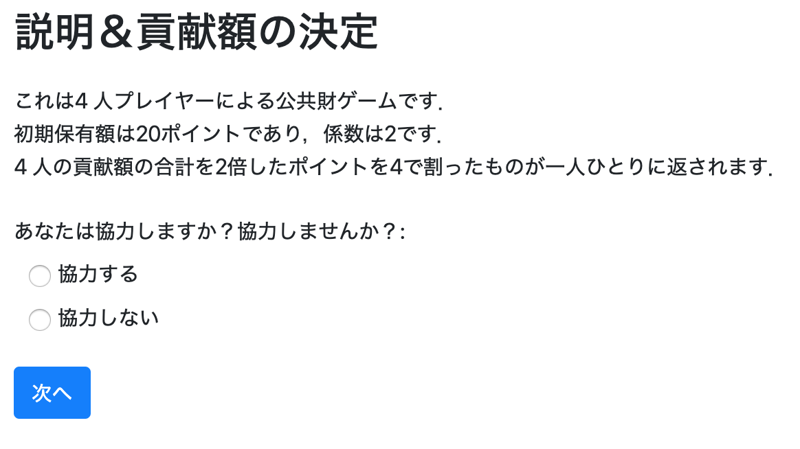
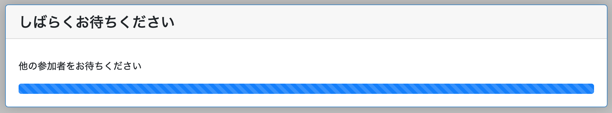
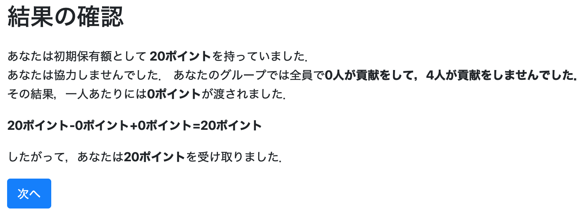

# プログラム②：4人社会的ジレンマ

## これから作る実験プログラムの概要：

* 4人社会的ジレンマ
* 初期保有額を20ポイント
* 貢献額の入力には**協力するかしないかを選択する**
* 4人の貢献額を合計したものを2倍にする
* それぞれに貢献額の2倍を人数(4人)で割った額が戻る
* ページは3ページ
  - Page1：ルール説明＆協力するかしないかを決定するページ
  <br><br>
  - Page2：全員が協力するかしないか決めるまで待つページ
  <br><br>
  - Page3：結果を出力するページ
  <br><br>


## アプリをコピペする

* 先程作った公共財ゲームを元にして，4人社会的ジレンマゲームを作成する．．


* 土台となるアプリ`SD4_trial`をコピペします．
  - 名前を`SD4_trial`に変えます．
  - 変更すべきポイントは以下の3箇所です．
    - 最初のフォルダ名
    - models.pyの中
    - templatesフォルダの中の`SD4_trial`フォルダ
    - settings.pyの中の`SESSION_CONFIGS`内には新たに追記する（後ほど）


## modelsの定義：
* models.pyでは動作を定義します．

### Constantsクラスの定義：基本設計

* SD4_trialフォルダ内のmodels.pyを開く
* Constantsクラスの中で人数・繰り返し回数・初期保有額・係数を設定する．

```
class Constants(BaseConstants):
    name_in_url = ‘SD4_trial'
    players_per_group = 4 # 4人プレイヤー
    num_rounds = 1 # 1shotゲーム

    endowment = c(20) # 初期保有額は20ポイント
    multiplier = 2 # 全員の貢献額を2倍にします．
```
  - `names_in_url`，`players_per_group`，`num_rounds`はoTree上で定義されているため，任意の変数名として使うのは望ましくない
  - c()は通貨（金額）として扱うための関数
* **今回はどこもいじりません．**


### Playerクラスの定義：

* Playerクラスの中で，各プレイヤーに関する変数を定義する．

* 協力する場合には20ポイント貢献，協力しない場合には0ポイント貢献とする．

```
class Player(BasePlayer):
    contribution = models.CurrencyField(
        choices=[
            [c(0),'協力する'],
            [c(Constants.endowment), '協力しない']
            ],
        label="あなたは協力しますか？協力しませんか？",
        widget=widgets.RadioSelect # ラジオボタン使います．
    )
```
  - ここではプレイヤーが協力するかしないかを定義している．
  - 今回はラジオボタンでの選択方式にする．
    - 参考：`widget=widgets.RadioSelectHorizontal`にしたら水平（横並び）のラジオボタンになる．


### Groupクラスの定義
* Groupクラスの中で全てのプレイヤーの変数に影響を及ぼす関数を定義する．

```
class Group(BaseGroup):
total_contribution = models.CurrencyField() #全員の合計金額を入れる箱
individual_share = models.CurrencyField() #全員に分配される金額（合計金額を2倍して人数で割る）を入れる箱
    N_of_NoContribution = models.IntegerField() #協力しなかった人数を入れる箱
    N_of_Contribution = models.IntegerField() #協力した人数を入れる箱

    def compute(self):
        contributions = [p.contribution for p in self.get_players()] # Groupクラスにあるcontributionsとは，プレイヤー全員の貢献額の行列ですよ！
        self.total_contribution = sum(contributions)　# Groupクラスにあるtotal_contributionとは，contributionsの合計です．
        self.individual_share = self.total_contribution *　Constants.multiplier / Constants.players_per_group # Groupクラスにあるindividual_shareとは，Groupクラスにあるtotal_contributionとConstantsクラスにあるmultiplierをかけて，Constantsクラスにあるplayers_per_groupで割ったものです．
        self.N_of_NoContribution = contributions.count(0) # 協力しなかった人数の数を数えてください（Contributionが0の人数を数える）
        self.N_of_Contribution = Constants.players_per_group - self.N_of_NoContribution # 協力した人数の数を計算してください．（全参加者数- 貢献しなかった人数）


        for p in self.get_players(): # 各プレイヤーについて，こんな計算をしてください．
            p.payoff = Constants.endowment - p.contribution + self.individual_share # 各プレイヤーのpayoffはConstantsクラスのendowment(保有額)から各プレイヤーのcontributionを引いて，Groupクラスにあるindividual_shareを足します．

```

* `def`以下では関数を定義している．
  - 「こんな感じで計算してよう！よろしく＼(^o^)／」ということを定義している．

* `count`はPythonの関数
  - 普通に組み込んで計算させることもできます．


## templatesの定義：
* templatesでは具体的な項目を表示するページに決めていきます．

* `SD4_trial/templates/SD4_trialの中に`Page1.html`，`Page3.html`という2つのhtmlファイルを作成します．
  - `Page1`がルール説明と貢献額入力ページ，`Page3`が結果の表示ページとなる
  - 待ちページは追って説明する．


### 1ページ目

```html

    説明＆貢献額の決定


<p>
    これは{{ Constants.players_per_group }} 人プレイヤーによる公共財ゲームです．<br>
    初期保有額は{{ Constants.endowment }}であり，係数は{{ Constants.multiplier }}です．<br>
    {{ Constants.players_per_group }} 人の貢献額の合計を{{ Constants.multiplier }}倍したポイントを{{ Constants.players_per_group }}で割ったものが一人ひとりに返されます．<br>
    各プレイヤーは貢献するかしないかを決定します．

</p>

    

```

* html内で`{{ Constants.players_per_group }} `などの表記をすると，そこで定義した変数を表示することができる．
  - また後で戻るが，`pages.py`などで計算・定義した順番に気をつける必要がある．
  - 例えば，`{{ player.contribution }}（プレイヤーの貢献額）`は決まっていないので表示することができない．
    - エラーが表示される．


### 2ページ目
* 慌てない．

### 3ページ目

```html

    結果の確認



<p>
    あなたは初期保有額として<strong> {{ Constants.endowment }}</strong>を持っていました．<br>
    
    あなたは協力しませんでした．
    
    あなたは協力しました．
    

    あなたのグループでは全員で<strong>{{ group.N_of_Contribution }}人が貢献をして，{{ group.N_of_NoContribution }}人が貢献をしませんでした．</strong><br>
    その結果，一人あたりには<strong>{{ group.individual_share }}</strong>が渡されました．<br>
</p>
<p>
    <strong>{{ Constants.endowment }}-{{ player.contribution }}+{{ group.individual_share }}={{ player.payoff }}</strong>
</p>
<p>
    したがって，あなたは<strong>{{ player.payoff }}</strong>を受け取りました．
</p>
    


```


## pagesの定義：

* **今回はどこもいじりません．**

* `pages.py`では「ページの表示順」や「入力項目」，**「関数の計算の順番」** などを設定します．
  - 実は**「関数の計算の順番」** がかなりややこしくて難しい．

* `pages.py`で設定する動作
  - `Page1.html`を表示する
    - 公共財ゲームの説明と貢献額を入力する．
  -`Page2.html`を表示する
    - 全員の貢献額が決定するまで待つ
    - 全員の貢献額が決定次第，一人ひとりの利益を計算する．
  - `Page3.html`を表示する
    - 各自の利益を表示する．

  - Page1の次にPage2を，その次にPage3を表示するように設定する．

### Page.1について
* `Page1`では貢献額の入力があります．
  - 入力画面を作ってあげましょう．


```
class Page1(Page):
    form_model = 'player'
    form_fields = ['contribution']
```

### Page.2について

* 全員のデータが集まってから計算する．
```
class Page2(WaitPage):

    def after_all_players_arrive(self):
        self.group.compute()
```
* WaitPage：用意されている「全員集合！」のページを表示する
* def after_all_players_arrive(self):
  - 全てのプレイヤーが「全員集合！」のページにたどり着くのを待ってから，それ以降の関数を実行する．
  - 全員の貢献額の合計＆一人ひとりの利得を計算する．


### Page.3について
* 実験参加者が入力する項目がない時はpassします．

```
class Page3(Page):
    Pass
```


### 表示する順番を定義する

* **今回はどこもいじりません．**
* 一番最後に画面を表示する順番を定義します．
```
page_sequence = [
    Page1,
    Page2,
    Page3
]
```


## settingにおけるsession configsの定義：

* oTree で実験を実装するには，`settings.py`の中の`SESSION_CONFIGS`にアプリを登録する必要があります．
* ここでは公共財ゲームに追記する形で記載します．

```
SESSION_CONFIGS = [
    dict(
        name='PG4',
        display_name="はじめての公共財ゲーム",
        num_demo_participants=4,
        app_sequence=['public_goods_trial']
    ),
    dict(
        name='SD4',
        display_name="はじめての社会的ジレンマ",
        num_demo_participants=4,
        app_sequence=['SD4_trial']
    ),
]
```


## サーバとして起動
* 自身の端末をサーバとして起動します．
```
otree devserver
```
  - これで自身の端末で実験を実施することができます．
  - `http://localhost:8000/`にアクセスしてみてください．


## 全てのコード

[ダウンロード](SD4_trial.zip)
