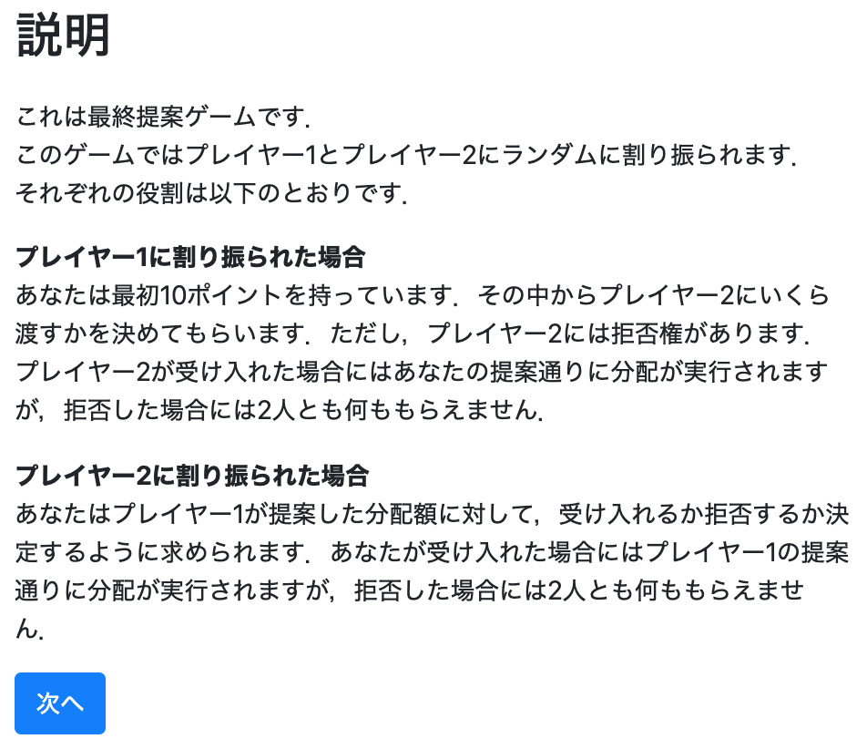
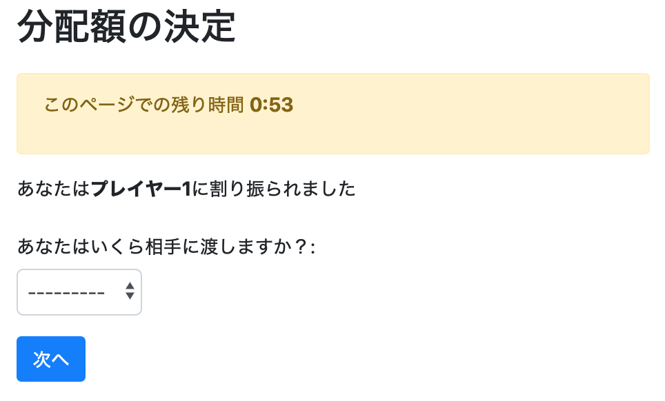
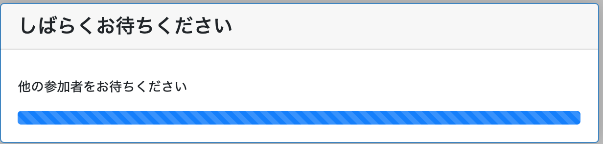
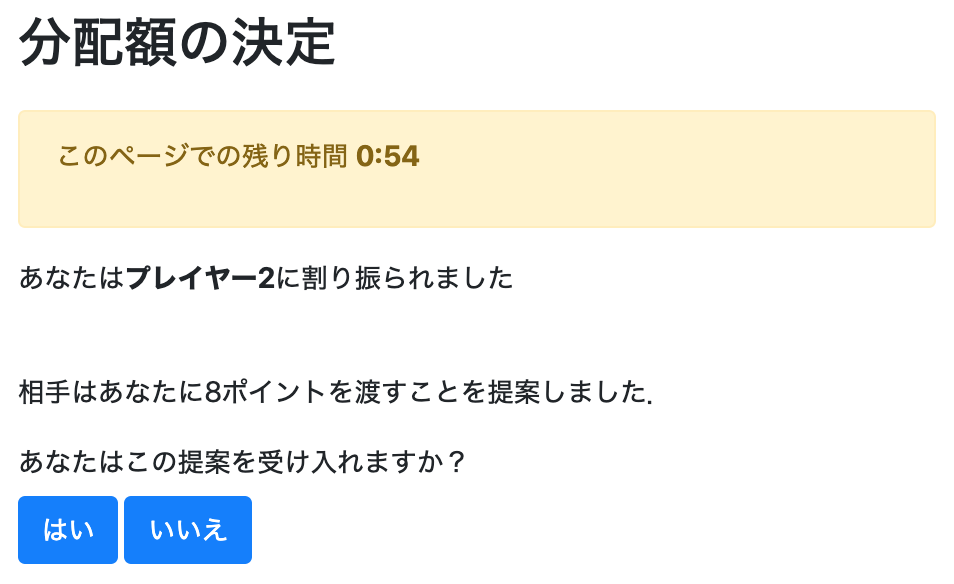
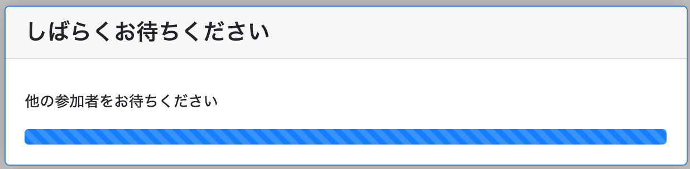
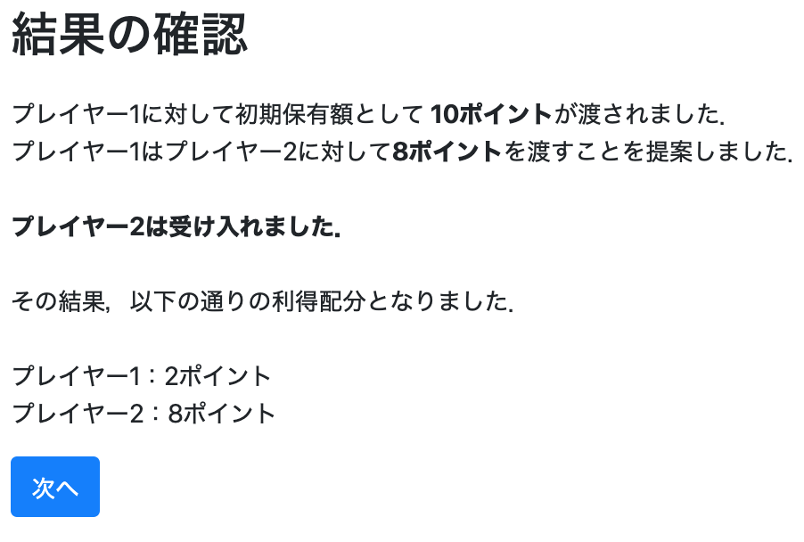

# プログラム③：最終提案ゲーム

## これから作る実験プログラムの概要：

* 2人最終提案ゲーム
* 提案者の初期保有額を10ポイント
* 提案者は0-10ポイントの中から好きな金額を提案できる．
* 応答者は提案者の提案に対して，**拒否する** か **受け入れる** か
* 拒否をした場合は（提案者の利得，応答者の利得）＝（0, 0）になるが，受け入れた場合は提案者の提案する分配が実現
* ページは3ページ
  - Page1：ルール説明のページ
     <br><br>
  - Page2：（提案者のみ）提案額を決定するページ
     <br><br>
  - Page3：（応答者のみ）提案者の決定を待つページ
     <br><br>
  - Page4：（応答者のみ）受け入れるか否かを決定するページ
     <br><br>
  - Page5：（提案者のみ）応答者の決定を待つページ
     <br><br>
  - Page6：結果を出力するページ
     <br><br>


## アプリを作成する

* その前にフォルダを移動します．
  * Windowsの場合
  ```
  cd C:¥Users¥[PC名]¥Desktop¥otreetest
  ```

  * Macの場合
  ```
  cd Desktop/otreetest
  ```


* 土台となるアプリを作成します．
```
otree startapp ultimatum_trial
```


## modelsの定義：
* models.pyでは動作を定義します．

### Constantsクラスの定義：基本設計

* SD4_trialフォルダ内のmodels.pyを開く
* Constantsクラスの中で人数・繰り返し回数・初期保有額・係数を設定する．

```
class Constants(BaseConstants):
    name_in_url = 'ultimatum_trial'
    players_per_group = 2 # 2人プレイヤー
    num_rounds = 1 # 1shotゲーム

    endowment = c(10) # 提案者の初期保有額は10ポイント
```


### Playerクラスの定義：

* Playerクラスの中で，各プレイヤーに関する変数を定義する．

```
class Player(BasePlayer):
  pass
```
  - 今回は全てをGroupクラスの中で定義します．


### Groupクラスの定義
* Groupクラスの中で全てのプレイヤーの変数に影響を及ぼす関数を定義する．

```
class Group(BaseGroup):
# プレイヤーの選択を定義する．
## プレイヤー1の選択は提案額を決める．
    proposal = models.CurrencyField(
        choices=currency_range(c(0), c(Constants.endowment), c(1)),
        label="あなたはいくら相手に渡しますか？",
    )
## プレイヤー2の選択は提案額を受け入れるかどうか．
    accepted_or_not = models.BooleanField( # BooleanFieldにすることでTRUE/FALSEの選択
        doc="あなたは提案を受け入れますか？"
    )

    proposer_point = models.CurrencyField() # プレイヤー1の利得
    accepter_point = models.CurrencyField() # プレイヤー2の利得

# 計算を実行する
    def compute(self):
        if self.accepted_or_not==True: # プレイヤー1が受け入れた場合
            self.proposer_point = Constants.endowment - self.proposal #プレイヤー1の初期保有額-プレイヤー2への提案額
            self.accepter_point = self.proposal #プレイヤー2への提案額
        else: # 拒否した場合
            self.proposer_point = 0 # 何ももらえません
            self.accepter_point = 0 # 何ももらえません
```

* `def`以下では関数を定義している．
  - 「こんな感じで計算してよう！よろしく＼(^o^)／」ということを定義している．

* `count`はPythonの関数
  - 普通に組み込んで計算させることもできます．


## templatesの定義：
* templatesでは具体的な項目を表示するページに決めていきます．

* `ultimatum_trial/templates/ultimatum_trial`の中に`Page1.html`，`Page2.html`，`Page4.html`，`Page6.html`という4つのhtmlファイルを作成します．
  - `Page1`がルール説明ページ，`Page2`が提案者の提案額入力ページ，`Page4`が応答者の受入判断ページ，`Page6`が結果の表示ページとなる．
  - 待ちページは追って説明する．


### 1ページ目
```html

    説明


<p>
    これは最終提案ゲームです．<br>
    このゲームではプレイヤー1とプレイヤー2にランダムに割り振られます．<br>
    それぞれの役割は以下のとおりです．
</p>
<div>
<strong>プレイヤー1に割り振られた場合</strong>
<p>
  あなたは最初{{ Constants.endowment }}を持っています．その中からプレイヤー2にいくら渡すかを決めてもらいます．ただし，プレイヤー2には拒否権があります．プレイヤー2が受け入れた場合にはあなたの提案通りに分配が実行されますが，拒否した場合には2人とも何ももらえません．
</p>
</div>

<div>
<strong>プレイヤー2に割り振られた場合</strong>
<p>
  あなたはプレイヤー1が提案した分配額に対して，受け入れるか拒否するか決定するように求められます．あなたが受け入れた場合にはプレイヤー1の提案通りに分配が実行されますが，拒否した場合には2人とも何ももらえません．
</p>
</div>

    


```


### 2ページ目
```html




    分配額の決定


<p>
    あなたは<strong>プレイヤー1</strong>に割り振られました
</p>

    

```

### 3ページ目
* 慌てない

### 4ページ目
```

    分配額の決定


<p>
    あなたは<strong>プレイヤー2</strong>に割り振られました
</p>
<br>
<p>
    相手はあなたにを渡すことを提案しました．
</p>

<div class="form-group required">
    <label class="control-label">あなたはこの提案を受け入れますか？</label>
    <div class="controls">
        <button name="accepted_or_not" value="True" class="btn btn-primary btn-large">はい</button>
        <button name="accepted_or_not" value="False" class="btn btn-primary btn-large">いいえ</button>
    </div>
</div>


```

### 5ページ目
* 慌てない

### 6ページ目
```html

    結果の確認



<p>
    プレイヤー1に対して初期保有額として<strong> {{ Constants.endowment }}</strong>が渡されました．<br>
    プレイヤー1はプレイヤー2に対して<strong>{{ group.proposal }}</strong>を渡すことを提案しました．<br>
    <br>
    
    <strong> プレイヤー2は受け入れませんでした．</strong><br>
    
    <strong> プレイヤー2は受け入れました．</strong><br>
    
    <br>
    その結果，以下の通りの利得配分となりました．<br>
    <br>
    プレイヤー1：{{ group.proposer_point }}<br>
    プレイヤー2：{{ group.accepter_point }}<br>

    


```


## pagesの定義：

* `pages.py`では「ページの表示順」や「入力項目」，**「関数の計算の順番」** などを設定します．
  - 実は**「関数の計算の順番」** がかなりややこしくて難しい．

* `pages.py`で設定する動作
  - `Page1.html`を表示する
    - 最終提案ゲームのルールを説明する
  - `Page2.html`を表示する
    - プレイヤー1(提案者)にだけ表示する
    - 提案額を入力する
  - `Page3.html`を表示する
    - プレイヤー2(応答者)にだけ表示する
    - プレイヤー1の入力を待つ
  - `Page4.html`を表示する
    - プレイヤー2(応答者)にだけ表示する
    - 協力するか否かの判断を入力する
  - `Page5.html`を表示する
    - プレイヤー1(提案者)にだけ表示する
    - プレイヤー2の入力を待つ
  - `Page6.html`を表示する
    - 各自の利益を表示する．


  - `Page1`から`Page6`を順番に表示するように設定する．

### Page1について
* `Page1`は何も入力欄の表示や，計算などの特別な動きはありません．
```
class Page1(Page):
    pass
```

### Page2について
* `Page2`では提案額の入力があります．
  - 60秒の時間制限を設定します．
  - 入力画面を作ってあげましょう．
  - 表示されるプレイヤーが限定されます．

```
class Page2(Page):
  timeout_seconds = 60
  form_model = 'group'
  form_fields = ['proposal']

  def is_displayed(self):
      return self.player.id_in_group == 1
```

### Page3について
* Page2に入らなかったプレイヤー（Page2をスキップしたプレイヤー）はPage3に進みます．
```
class Page3(WaitPage):
    pass
```
  - ここでは特に処理すべきことはありません．

### Page4について
* `Page4`では受入判断の入力があります．
  - 60秒の時間制限を設定します．
  - 入力画面を作ってあげましょう．
  - 表示されるプレイヤーが限定されます．

```
class Page4(Page):
  timeout_seconds = 60
  form_model = 'group'
  form_fields = ['accepted_or_not']

  def is_displayed(self):
      return self.player.id_in_group == 2
```


### Page5について
* Page4に入らなかったプレイヤー（Page4をスキップしたプレイヤー）はPage5に進みます．
```
class Page5(WaitPage):
  def after_all_players_arrive(self):
      self.group.set_payoffs()
```
* WaitPage：用意されている「全員集合！」のページを表示する
* def after_all_players_arrive(self):
  - 全てのプレイヤーが「全員集合！」のページにたどり着くのを待ってから，それ以降の関数を実行する．
  - 全員の貢献額の合計＆一人ひとりの利得を計算する．


### Page6について
* 実験参加者が入力する項目がない時はpassします．

```
class Page6(Page):
    pass
```


### 表示する順番を定義する

* **今回はどこもいじりません．**
* 一番最後に画面を表示する順番を定義します．
```
page_sequence = [
    Page1,
    Page2,
    Page3,
    Page4,
    Page5,
    Page6
]
```


## settingにおけるsession configsの定義：

* oTree で実験を実装するには，`settings.py`の中の`SESSION_CONFIGS`にアプリを登録する必要があります．
* ここでは公共財ゲームに追記する形で記載します．

```
SESSION_CONFIGS = [
    dict(
        name='PG4',
        display_name="はじめての公共財ゲーム",
        num_demo_participants=4,
        app_sequence=['public_goods_trial']
    ),
    dict(
        name='SD4',
        display_name="はじめての社会的ジレンマ",
        num_demo_participants=4,
        app_sequence=['SD4_trial']
    ),
    dict(
        name='UG',
        display_name="はじめての最終提案ゲーム",
        num_demo_participants=2,
        app_sequence=['ultimatum_trial']
    ),

]
```


## サーバとして起動
* 自身の端末をサーバとして起動します．
```
otree devserver
```
  - これで自身の端末で実験を実施することができます．
  - [http://localhost:8000/](http://localhost:8000/)にアクセスしてみてください．


## 全てのコード

[ダウンロード](UG_trial.zip)
